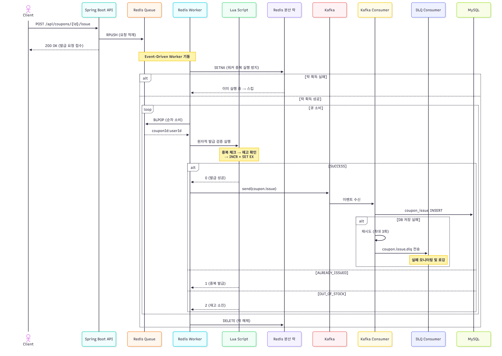

# 🎫 Fast Coupon Service

**선착순 쿠폰 발급 시스템**

대규모 트래픽 환경에서 중복 발급 없이 안정적으로 쿠폰을 처리하기 위한 시스템입니다.  
Redis Lua Script 기반 원자적 재고 검증, Redis Queue 기반 순서 보장, Kafka 비동기 DB 저장을 결합한 **3단계 파이프라인**으로 성능과 정합성을 동시에 확보했습니다.

---

## 프로젝트 개요

| 항목 | 내용 |
|---|---|
| **기간** | 2025.04.15 ~ 2025.05.09 |
| **개발** | 송현진 (개인 프로젝트) |
| **GitHub** | [SongHyeonJin/fast-coupon-service](https://github.com/SongHyeonJin/fast-coupon-service) |

---

## 기술 스택

| 분류 | 기술 |
|---|---|
| Language | Java 21 |
| Framework | Spring Boot 3.2.5, Spring Security, Spring Data JPA |
| Database | MySQL |
| In-Memory | Redis (Lua Script, 분산 락, List Queue) |
| Message Broker | Apache Kafka (RetryableTopic, DLQ) |
| Infra | Docker Compose (Kafka + Zookeeper) |
| Testing | JUnit 5, MockMvc, Awaitility |
| Load Test | k6 (10,000 VU) |
| Build | Gradle |
| Logging | Logback, MDC (traceId) |

---

## 시스템 아키텍처



---

## 핵심 구현 상세

### 1. Redis Lua Script - 원자적 쿠폰 발급

하나의 Lua Script 안에서 **중복 발급 체크 → 재고 확인 → 카운트 증가 → 유저 키 설정**을 원자적으로 수행하여 Race Condition을 원천 차단합니다.

```lua
-- 이미 발급받은 유저인지 확인
if redis.call("EXISTS", userKey) == 1 then
    return 1 -- 중복 발급
end

-- 현재 발급된 수 확인
local current = tonumber(redis.call("GET", countKey) or "0")
if current >= total then
    return 2 -- 재고 없음
end

-- 발급 처리 (카운트 증가 + userKey 설정 + TTL 적용)
redis.call("INCR", countKey)
redis.call("SET", userKey, "true", "EX", ttl)
return 0 -- 발급 성공
```

- 반환값: `0` SUCCESS / `1` ALREADY_ISSUED / `2` OUT_OF_STOCK

### 2. Redis Queue + Event-Driven Worker

```
사용자 요청 → Redis List RPUSH → ApplicationEvent 발행 → Worker BLPOP 소비
```

- **순서 보장**: Redis List(FIFO)로 요청 순서 보장
- **분산 락**: `setIfAbsent` (SETNX + TTL)로 멀티 서버 환경에서 동일 쿠폰에 대한 워커 중복 실행 방지
- **자동 정리**: 발급 완료 시 Redis 키(queue, count, total, user:*, expire) 자동 cleanup

### 3. Kafka 비동기 DB 저장 + DLQ 장애 처리

- Redis에서 발급 성공 시 `coupon.issue` 토픽으로 이벤트 발행
- Consumer가 수신하여 MySQL에 `coupon_issue` 레코드 저장
- `@RetryableTopic`: 최대 **3회 재시도** (backoff: 2s → 4s)
- 재시도 실패 시 `coupon.issue.dlq` 토픽으로 자동 전송, DLQ Consumer에서 모니터링
- `DataIntegrityViolationException` (중복 insert)은 재시도 없이 무시

### 4. 동시성 제어 다중 방어

| 계층 | 방어 수단 |
|---|---|
| Redis Lua | 원자적 중복/재고 검증 (1차) |
| Redis Queue | pushQueue 시 이미 발급된 유저·재고 소진 상태 사전 필터링 (2차) |
| DB Unique | `@UniqueConstraint(coupon_id, user_id)` (최종 방어) |

### 5. 쿠폰 생명주기 관리

- **생성**: 관리자가 쿠폰 등록 시 Redis에 총 수량(`coupon:{id}:total`)과 만료 TTL 자동 설정
- **발급**: 선착순 파이프라인 (Redis → Kafka → DB)
- **사용**: 만료/이미 사용/권한 다단계 검증 후 상태 변경
- **만료**: `@Scheduled` 크론 스케줄러가 매시간 만료 쿠폰의 미사용 발급건 일괄 `EXPIRED` 처리

### 6. 인증/인가

- Spring Security + HttpSession 기반 세션 인증
- 로그인 시 AOP(`@LoginSessionInject`)로 세션에 userId/email/role 자동 저장
- `SessionAuthenticationFilter`에서 세션 복원 및 관리자 API 접근 제어

### 7. 로깅 & 관측성

- `CachingRequestFilter`에서 **UUID 기반 traceId**를 MDC에 주입하여 요청 추적
- 요청/응답 바디 로깅 (비밀번호 필드 마스킹 처리)
- Kafka 전송 성공/실패, 워커 상태 변화 등 주요 이벤트 구조적 로깅

---

## 프로젝트 구조

```
src/main/java/com/example/fastcoupon/
├── config/               # Redis, Kafka, Security, JPA, WebMvc 설정
├── controller/           # REST API (CouponController, AdminCouponController, UserController)
├── dto/                  # 요청/응답 DTO (coupon, user, common)
├── entity/               # JPA 엔티티 (Coupon, CouponIssue, User, KafkaDlqLog)
├── enums/                # Enum (CouponType, CouponStatus, CouponIssue, UserRole, Exception)
├── exception/            # 전역 예외 처리 (GlobalExceptionHandler)
├── kafka/                # Kafka Producer, Consumer, DLQ Consumer
├── logging/              # MDC traceId 필터, 요청/응답 로깅
├── redis/                # RedisCouponService (Lua Script), RedisQueueWorker
├── repository/           # JPA Repository
├── scheduler/            # 쿠폰 만료 스케줄러
├── security/             # 세션 인증 필터, UserDetailsImpl
├── service/              # 비즈니스 로직 (AdminCouponService, CouponUseService, UserService)
└── aop/                  # 로그인 세션 주입 AOP

k6/                       # 부하 테스트 스크립트 (10,000 VU 동시 요청)
docker-compose.yml        # Kafka + Zookeeper 개발 환경
```

---

## API 명세

| Method | Endpoint | 설명 | 인증 |
|---|---|---|---|
| POST | `/api/signup` | 회원가입 | - |
| POST | `/api/login` | 로그인 (세션 발급) | - |
| POST | `/api/admin/coupons` | 쿠폰 등록 | ADMIN |
| POST | `/api/coupons/{couponId}/issue` | 쿠폰 발급 요청 | USER |
| POST | `/api/coupons/{couponId}/issued/{couponIssueId}/use` | 쿠폰 사용 | USER |

---

## 테스트

### 단위/통합 테스트

| 테스트 | 검증 내용 |
|---|---|
| `CouponControllerTest` | 500명 동시 요청 → 100장 정확 발급 (CountDownLatch + Awaitility) |
| `CouponIssueProducerTest` | Kafka 이벤트 전송 → Consumer DB 저장 E2E 검증 |
| `CouponUseServiceTest` | 쿠폰 사용 성공/권한 없음/이미 사용/만료 시나리오 |

### 부하 테스트 (k6)

- **10,000명 동시 접속**, 쿠폰 100장 선착순 발급
- 멀티 서버 분산 (8080/8081 각 5,000명)
- 로그인 → 세션 쿠키 획득 → 쿠폰 발급 요청 전체 시나리오

```bash
k6 run k6/coupon-test.js
```

---

## 실행 방법

### 1. 인프라 실행

```bash
docker-compose up -d
```

### 2. MySQL 설정

`application.yml`에서 MySQL 연결 정보 확인 후 데이터베이스 생성:

```sql
CREATE DATABASE fastcoupon;
```

### 3. 애플리케이션 실행

```bash
./gradlew bootRun
```

### 4. 부하 테스트 실행 (선택)

```bash
k6 run k6/coupon-test.js
```

---

## 프로젝트를 통해 경험한 점

### Redis Lua Script 기반 동시성 제어
Lua 스크립트를 활용해 중복 발급 및 재고 초과 여부를 원자적으로 검증하며, 대량 요청에서도 일관성 있는 처리를 경험했습니다.

### 비동기 이벤트 기반 아키텍처 설계
Redis Queue → Kafka → DB로 이어지는 비동기 파이프라인을 구축하고, 각 계층의 역할을 분리하여 처리량을 극대화했습니다.

### 장애 복원력 확보
Kafka RetryableTopic과 DLQ 패턴을 적용하여 메시지 처리 실패 시에도 데이터 유실 없이 복구할 수 있는 구조를 설계했습니다.

### 멀티 서버 환경 대응
Redis 분산 락(SETNX)으로 워커 중복 실행을 방지하고, k6를 활용한 멀티 서버 부하 테스트로 실제 운영 환경 수준의 검증을 수행했습니다.

### 선착순 보장 구조 개선
초기 Lua 단독 처리의 순서 불안정 문제를 Redis Queue(FIFO) 도입으로 해결하고, 이벤트 기반 워커 기동 방식으로 구조를 개선했습니다.
